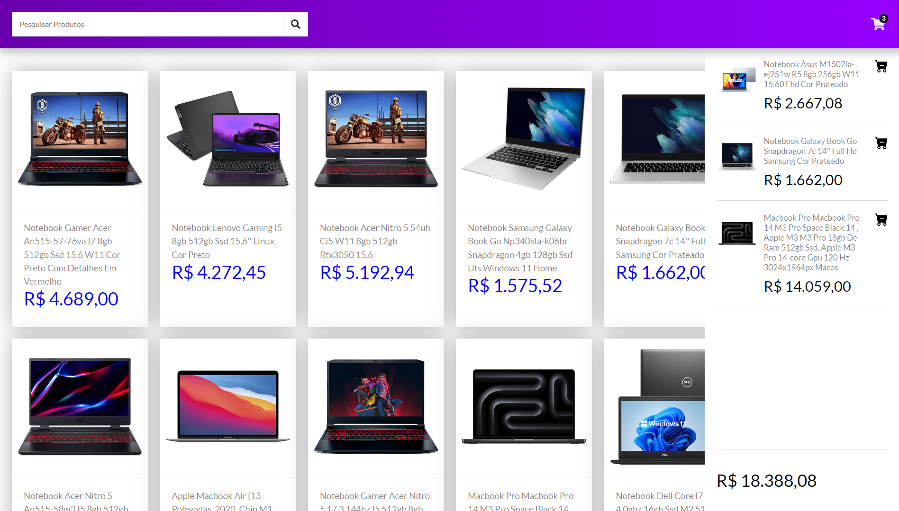
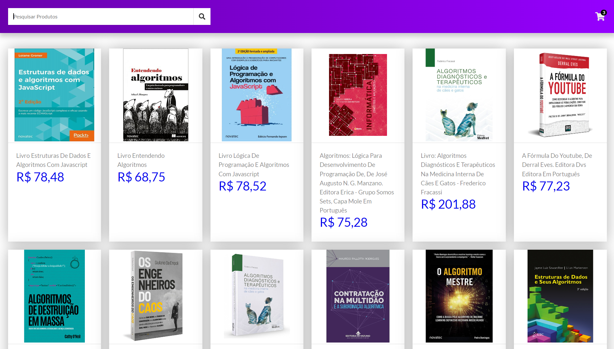

# Carrinho em React! 🛒

Este projeto foi utilizado para praticar meus conhecimentos em React, e ele consiste em um simples carrinho de compras online, porém, para os produtos foi utilizado uma API do [Mercado Livre](https://www.mercadolivre.com.br/), trazendo todos os dados de seus produtos para a aplicação.

## Funcionalidades da Aplicação

- **Busca de Produtos:** Permite pesquisar por produtos diretamente do Mercado Livre!
- **Adição e remoção:** É possível adicionar e remover produtos do carrinho.
- **Listagem de Produtos:** Exibe uma lista de produtos obtidos da API do Mercado Livre.

## Tecnologias Utilizadas 🧰

## Visitar o Projeto! 🌐

O projeto está disponível na internet, para acessar basta [clicar aqui!](https://carrinho-react-ten.vercel.app/).

O deploy da aplicação foi realizada por meio do [Vercel](https://vercel.com/).

## Pré-Visualização 📷

